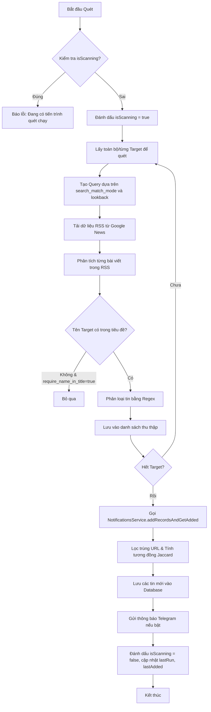

# FDA System Migration Blueprint: SQLite to MongoDB & Standalone to Centralized System

Tài liệu này cung cấp một bản thiết kế chi tiết (Blueprint) phục vụ cuộc cách mạng chuyển đổi hệ thống **FDA (Follow Director Activities)** từ cơ sở dữ liệu **SQLite cục bộ** sang hệ thống **MongoDB dùng chung**, đồng thời chuyển đổi mô hình vận hành từ **máy cá nhân đơn lẻ** sang **hệ thống trung tâm chia sẻ**.

---

## MỤC LỤC

1. [Phân Tích Hệ Thống Hiện Tại &amp; Cơ Sở Dữ Liệu SQLite](#1-phân-tích-hệ-thống-hiện-tại-cơ-sở-dữ-liệu-sqlite)
2. [Chi Tiết Chức Năng Quét Bài Viết (Article Scanner)](#2-chi-tiết-chức-năng-quét-bài-viết-article-scanner)
3. [Chi Tiết Cơ Chế Đăng Nhập &amp; Refresh Token](#3-chi-tiết-cơ-chế-đăng-nhập--refresh-token)
4. [Thiết Kế Chuyển Đổi Sang MongoDB (Mongoose Schema)](#4-thiết-kế-chuyển-đổi-sang-mongodb-mongoose-schema)
5. [Kiến Trúc Hệ Thống Dùng Chung (Centralized Shared System)](#5-kiến-trúc-hệ-thống-dùng-chung-centralized-shared-system)
6. [Lộ Trình Triển Khai Chuyển Đổi Từng Bước (Migration Roadmap)](#6-lộ-trình-triển-khai-chuyển-đổi-từng-bước-migration-roadmap)

---

## 1. PHÂN TÍCH HỆ THỐNG HIỆN TẠI & CƠ SỞ DỮ LIỆU SQLITE

Hệ thống hiện tại sử dụng **TypeORM** kết hợp với **SQLite (`better-sqlite3`)** lưu dữ liệu cục bộ dưới dạng file duy nhất tại `apps/api/data/fda.db`. Dưới đây là chi tiết cấu trúc 5 bảng dữ liệu hiện tại:

### 1.1. Bảng `users` (Quản lý tài khoản và phân quyền)

* **Mục đích:** Lưu thông tin người dùng đăng nhập hệ thống.
* **Các cột dữ liệu:**
  * `id`: Kiểu `number`, khóa chính tự tăng (Primary Auto-Increment).
  * `email`: Kiểu `string`, có chỉ mục duy nhất (`unique: true`), dùng làm tài khoản đăng nhập.
  * `password`: Kiểu `string`, lưu mật khẩu người dùng đã băm bằng **bcrypt** với độ muối (salt rounds) là 12.
  * `role`: Kiểu `varchar` (enum `UserRole`), có hai vai trò chính: `'admin'` (toàn quyền cấu hình, CRUD targets, quét tin, xóa dữ liệu) và `'viewer'` (chỉ xem dashboard, chi tiết tin và gán nhãn thủ công). Mặc định là `'viewer'`.
  * `refreshToken`: Kiểu `varchar`, lưu trữ Refresh Token hiện tại của user sau khi đã băm bằng **bcrypt** (dùng cho cơ chế tự động gia hạn phiên). Có thể `null`.
  * `createdAt` & `updatedAt`: Kiểu `datetime`, tự động sinh khi bản ghi được tạo và cập nhật.

### 1.2. Bảng `targets` (Danh sách các nhân vật cần theo dõi)

* **Mục đích:** Lưu thông tin cá nhân của các nhân vật được giám sát.
* **Các cột dữ liệu:**
  * `id`: Kiểu `string`, dạng **UUID**, làm khóa chính.
  * `name`: Kiểu `string`, chỉ mục duy nhất (`unique: true`), lưu tên nhân vật (ví dụ: *"Nguyễn Văn A"*).
  * `position`: Kiểu `string`, chức vụ hiện tại của nhân vật. Mặc định là rỗng `""`.
  * `bio`: Kiểu `string`, tóm tắt thông tin tiểu sử. Mặc định là rỗng `""`.
  * `createdAt` & `updatedAt`: Kiểu `datetime`, tự động sinh.

### 1.3. Bảng `notifications` (Bài viết tin tức quét được)

* **Mục đích:** Lưu trữ tất cả tin tức quét từ Google News liên quan đến các nhân vật.
* **Các cột dữ liệu:**
  * `id`: Kiểu `number`, khóa chính tự tăng.
  * `timestamp`: Kiểu `string` (định dạng ISO 8601), thời gian bài báo được xuất bản.
  * `scan_time`: Kiểu `string` (định dạng ISO 8601), thời gian hệ thống tiến hành quét bài viết này. Có thể `null`.
  * `target_name`: Kiểu `string`, tên của nhân vật được liên kết với tin tức.
  * `target_position`: Kiểu `string`, chức vụ nhân vật tại thời điểm quét.
  * `target_bio`: Kiểu `string`, tiểu sử nhân vật tại thời điểm quét.
  * `title`: Kiểu `string`, tiêu đề bài viết.
  * `description`: Kiểu `text`, tóm tắt nội dung bài viết.
  * `url`: Kiểu `string`, đường dẫn gốc tới bài viết từ RSS.
  * `resolved_url`: Kiểu `string`, đường dẫn thực tế sau khi giải mã (nếu cần).
  * `published`: Kiểu `string`, chuỗi thời gian thô nhận từ RSS.
  * `news_kind`: Kiểu `string`, phân loại tin: `'hoatdong'` (tin hoạt động thường ngày) hoặc `'biendong'` (tin thay đổi/biến động chức vụ).
  * `press_name`: Kiểu `string`, tên nguồn báo (ví dụ: *"Báo Dân Trí"*).
  * `press_domain`: Kiểu `string`, tên miền của báo. Mặc định là rỗng `""`.
  * `ai_result`: Kiểu `text`, lưu trữ JSON dạng chuỗi (`JSON.stringify`) chứa kết quả phân tích hoặc phân loại bổ sung từ hệ thống tự động quét.
  * `user_label`: Kiểu `varchar`, nhãn do người dùng đánh giá thủ công: `null`, `'relevant'` (liên quan), hoặc `'irrelevant'` (không liên quan - ẩn khỏi màn hình chính).
* **Chỉ mục duy nhất (Composite Index):** `@Index(['url', 'target_name'], { unique: true })` nhằm đảm bảo một URL bài viết không bị trùng lặp đối với cùng một nhân vật.

### 1.4. Bảng `settings` (Cấu hình hệ thống toàn cục)

* **Mục đích:** Lưu trữ cấu hình vận hành của hệ thống FDA (chỉ có duy nhất 1 hàng với `id = 1`).
* **Các cột dữ liệu:**
  * `id`: Kiểu `number`, khóa chính mặc định là `1`.
  * `search_match_mode`: Kiểu `string`, chế độ tạo query tìm kiếm Google News. Giá trị gồm: `'exact_name'`, `'exact_position'`, `'exact'`, hoặc `'related'`. Mặc định: `'exact_name'`.
  * `max_results_per_target`: Kiểu `number`, giới hạn số tin tối đa lấy về cho mỗi mục tiêu trong một lần quét. Mặc định: `20`.
  * `scan_lookback_days`: Kiểu `number`, số ngày tìm kiếm ngược về quá khứ (sử dụng toán tử `when:Nd` trên Google News). Mặc định: `30`.
  * `require_name_in_title`: Kiểu `boolean`, bắt buộc tên của nhân vật phải xuất hiện trong tiêu đề bài viết thì mới lưu lại. Mặc định: `true`.
  * `auto_scan_enabled`: Kiểu `boolean`, bật/tắt cơ chế quét tự động định kỳ. Mặc định: `false`.
  * `scan_interval_minutes`: Kiểu `number`, chu kỳ chạy quét tự động (tính bằng phút). Mặc định: `30`.
  * `ui_refresh_seconds`: Kiểu `number`, khoảng thời gian tự động tải lại dữ liệu trên giao diện web. Mặc định: `30`.
  * `filter_chinh_thong_only`: Kiểu `boolean`, chỉ hiển thị các nguồn báo trong danh sách báo chính thống được cấu hình sẵn. Mặc định: `false`.
  * `telegram_enabled`: Kiểu `boolean`, bật/tắt gửi thông báo tự động qua Telegram. Mặc định: `false`.
  * `telegram_notify_role_change_only`: Kiểu `boolean`, chỉ gửi thông báo Telegram cho các bài viết được phân loại là biến động chức vụ (`biendong`). Mặc định: `false`.
  * `telegram_notify_on_empty`: Kiểu `boolean`, gửi thông báo báo cáo ngay cả khi phiên quét đó không tìm thấy tin mới. Mặc định: `false`.
  * `telegram_bot_token`: Kiểu `string`, Token của Bot Telegram.
  * `telegram_chat_id`: Kiểu `string`, Chat ID nhận tin (Group hoặc cá nhân).
  * `press_sources`: Kiểu `text`, lưu chuỗi JSON danh sách các nguồn báo chính thống gồm tên báo và link trang chủ. Mặc định: `'[]'`.

### 1.5. Bảng `scan_status` (Trạng thái quét hiện hành)

* **Mục đích:** Lưu trữ trạng thái tiến hành của tiến trình quét tin (chỉ có duy nhất 1 hàng với `id = 1`).
* **Các cột dữ liệu:**
  * `id`: Kiểu `number`, khóa chính mặc định là `1`.
  * `isScanning`: Kiểu `boolean`, cờ báo hiệu tiến trình quét đang chạy ngầm hay không. Mặc định: `false`.
  * `lastRun`: Kiểu `string` (ISO Timestamp), lưu thời điểm lần quét hoàn thành gần nhất.
  * `lastAdded`: Kiểu `number`, số lượng bài viết mới được thêm vào DB ở phiên quét gần nhất.
  * `lastError`: Kiểu `string`, lưu thông tin lỗi xảy ra gần nhất nếu phiên quét thất bại.
  * `currentTarget`: Kiểu `string`, tên của nhân vật đang được tiến hành quét tại thời điểm hiện tại (dùng để hiển thị trạng thái động trên frontend).

---

## 2. CHI TIẾT CHỨC NĂNG QUÉT BÀI VIẾT (ARTICLE SCANNER)

Tiến trình quét bài viết của FDA được xử lý bởi `ScannerService` (`apps/api/src/scanner/scanner.service.ts`), hoạt động theo mô hình tích hợp trực tiếp Google News RSS và tự động xử lý.



### 2.1. Chi tiết quy trình xử lý từng bước

1. **Đồng bộ Khóa Quét:** Đọc bản ghi đơn lẻ từ bảng `scan_status`. Nếu `isScanning` là `true`, chặn yêu cầu mới bằng lỗi `ConflictException`. Ngược lại, chuyển `isScanning = true` và lưu tên mục tiêu đang xử lý vào `currentTarget`.
2. **Thiết lập Query tìm kiếm:** Dựa trên `search_match_mode` được cấu hình từ bảng `settings`:
   * `exact_name`: Sử dụng cụm từ tìm kiếm trong ngoặc kép: `"[Tên nhân vật]"` (ví dụ: `"Nguyễn Văn A"`).
   * `exact`: Kết hợp cả tên và chức vụ đều nằm trong dấu nháy kép: `"[Tên nhân vật]" "[Chức vụ]"` (ví dụ: `"Nguyễn Văn A" "Chủ tịch"`).
   * `related`: Chỉ dùng tên trần không có ngoặc kép: `Nguyễn Văn A`.
   * Nếu có cấu hình `scan_lookback_days` > 0 (ví dụ: 30 ngày), thêm cú pháp giới hạn thời gian của Google News: ` when:30d`.
3. **Tải RSS Feed:** Gửi yêu cầu HTTPS tới endpoint RSS Google News:
   `https://news.google.com/rss/search?q=[QUERY]&hl=vi&gl=VN&ceid=VN:vi`
   Sử dụng thư viện `rss-parser` để chuyển đổi cấu trúc XML của RSS về định dạng JSON gồm các trường: `title`, `link` (URL gốc), `pubDate` (thời gian xuất bản), `contentSnippet` (mô tả ngắn).
4. **Kiểm tra Tên trên Tiêu đề (Require Name In Title):**
   Nếu cấu hình `require_name_in_title` được kích hoạt, hệ thống sẽ chuẩn hóa tiêu đề và tên nhân vật bằng cách loại bỏ dấu tiếng Việt (normalize `'NFD'`), chuyển về chữ thường và so sánh. Bài viết bị loại bỏ ngay nếu tiêu đề không chứa tên nhân vật.
5. **Phân loại loại tin tức (news_kind):**
   Sử dụng biểu thức chính quy (Regex) `ROLE_CHANGE_RE` để quét tiêu đề và phần mô tả ngắn nhằm tìm kiếm các từ khóa liên quan đến biến động nhân sự:
   ```typescript
   const ROLE_CHANGE_RE = /bổ\s*nhiệm|miễn\s*nhiệm|bãi\s*nhiệm|điều\s*động|luân\s*chuyển|giữ\s*chức|phân\s*công|tân\s*nhiệm|được\s*giao\s*giữ|thôi\s*giữ|cách\s*chức/i;
   ```

   * Nếu khớp Regex: Gán `news_kind = 'biendong'` (biến động chức vụ).
   * Nếu không khớp: Gán `news_kind = 'hoatdong'` (hoạt động thường).
6. **Xử lý khử trùng lặp (Deduplication Logic):**
   Khi lưu các bản ghi quét được vào Database qua hàm `addRecordsAndGetAdded` tại `NotificationsService`, hệ thống thực hiện hai bước lọc trùng:
   * *Trùng URL:* Kiểm tra xem liên kết `url` của tin mới có trùng với bài viết nào của nhân vật đó đã có trong Database hay chưa (sử dụng khóa tổ hợp `target_name|url`). Nếu có thì bỏ qua.
   * *Trùng nội dung (Jaccard Similarity):* Lấy danh sách các tiêu đề bài viết hiện có của nhân vật đó. Tiến hành tách từ tiêu đề cũ và tiêu đề mới thành các tập hợp từ (tokens) bằng cách bỏ tên báo, bỏ dấu, chuyển chữ thường và lọc từ đặc biệt. Tính chỉ số tương đồng Jaccard giữa hai tập từ:
     $$
     \text{Jaccard}(A, B) = \frac{|A \cap B|}{|A \cup B|}
     $$

     Nếu hệ số tương đồng $\ge 0.6$ (tức trùng nhau tối thiểu 60% lượng từ), hệ thống coi đây là bài báo đăng lại (repost) hoặc tin trùng lặp nội dung từ nguồn báo khác và **loại bỏ**.
7. **Thông báo Telegram:**
   Nếu cấu hình `telegram_enabled` được bật, hệ thống gom toàn bộ danh sách các tin thực sự được thêm mới (`addedRecords`).
   * Nếu bật `telegram_notify_role_change_only`, hệ thống lọc ra và chỉ gửi đi các tin có `news_kind = 'biendong'`.
   * Tự động gom nhóm tin theo tên nhân vật để soạn tin nhắn bằng định dạng HTML và gửi thông qua Telegram Bot API tới Chat ID.
8. **Tự động chạy định kỳ (Auto-Scan Task):**
   Hệ thống sử dụng `@nestjs/schedule` với một tiến trình chạy ngầm mỗi phút (`@Cron(CronExpression.EVERY_MINUTE)`).
   Mỗi phút, hệ thống sẽ so sánh: `Thời gian hiện tại - lastRun >= scan_interval_minutes`. Nếu thỏa mãn điều kiện và cấu hình `auto_scan_enabled = true`, tiến trình quét toàn bộ mục tiêu sẽ tự động khởi động.

---

## 3. CHI TIẾT CƠ CHẾ ĐĂNG NHẬP & REFRESH TOKEN

Hệ thống bảo mật của FDA sử dụng cơ chế cấp phát cặp **Access Token (JWT ngắn hạn)** và **Refresh Token (JWT dài hạn)** để đảm bảo an toàn bảo mật và mang lại trải nghiệm không gián đoạn cho người dùng.

```
       [ CLIENT / BROWSER ]                            [ BACKEND API ]
               |                                              |
               |---- 1. POST /auth/login (email/pwd) -------->| (Xác thực băm bcrypt)
               |<--- 2. Trả về: Access + Refresh Token -------| (Lưu Refresh đã hash vào DB)
               |                                              |
     (Lưu HTTP-only Cookies)                                  |
               |                                              |
               |---- 3. Gửi request (Mang theo Access Token) ->|
               |<--- 4. Phản hồi dữ liệu thành công ----------|
               |                                              |
        (Access Token hết hạn)                                |
               |                                              |
               |---- 5. Gửi request (Mang theo Access hết hạn)->|
               |<--- 6. Phản hồi lỗi 401 Unauthorized --------|
               |                                              |
   (Next.js Middleware chặn và tự động gửi refresh)            |
               |                                              |
               |---- 7. POST /auth/refresh (Gửi Refresh) ---->| (So sánh bcrypt với DB)
               |<--- 8. Trả về: Access + Refresh Token mới ---| (Cập nhật Refresh mới vào DB)
               |                                              |
(Cập nhật HTTP-only Cookies & Tiếp tục hành động gốc)
```

### 3.1. Phía Backend API (`apps/api/src/auth`)

* **Chi tiết quy trình cấp phát (Login):**
  * Người dùng gửi thông tin đăng nhập qua `POST /api/auth/login`. Bộ phận bảo vệ `local` strategy (`LocalStrategy`) sẽ kiểm tra sự tồn tại của Email trong cơ sở dữ liệu và dùng hàm `bcrypt.compare` để kiểm tra password.
  * Khi thông tin hợp lệ, `AuthService.login()` sẽ ký (sign) hai mã khóa JWT bằng thư viện `@nestjs/jwt`:
    * **Access Token:** Chứa payload `{ sub, email, role }`, ký bằng khóa bí mật `JWT_SECRET`, thời gian hết hạn thường là 15 phút (`JWT_EXPIRES_IN`).
    * **Refresh Token:** Chứa cùng payload, ký bằng khóa bí mật `JWT_REFRESH_SECRET`, thời gian hết hạn là 7 ngày (`JWT_REFRESH_EXPIRES_IN`).
  * Trước khi trả về, hệ thống thực hiện băm Refresh Token bằng **bcrypt** (salt rounds = 12) và cập nhật giá trị băm này vào trường `refreshToken` của User trong Database nhằm mục đích thu hồi hoặc đối chiếu sau này.
* **Chi tiết quy trình gia hạn (Refresh Token):**
  * Khi Access Token hết hạn, Client gọi endpoint `POST /api/auth/refresh` bằng cách gửi kèm Refresh Token gốc.
  * Endpoint này được bảo vệ bởi `jwt-refresh` strategy (`JwtRefreshStrategy`), trích xuất token từ body field `refreshToken`, giải mã bằng khóa bí mật `JWT_REFRESH_SECRET`.
  * Hàm `AuthService.refreshTokens(userId, refreshToken)` lấy thông tin người dùng từ DB. Đầu tiên, nó kiểm tra xem `refreshToken` trong DB có tồn tại hay không. Sau đó sử dụng `bcrypt.compare(refreshToken, user.refreshToken)` để đối chiếu mã gửi lên với mã đã mã hóa trong cơ sở dữ liệu.
  * Nếu trùng khớp, hệ thống sinh ra một cặp Access Token & Refresh Token hoàn toàn mới (cơ chế **Refresh Token Rotation** để đảm bảo an toàn), cập nhật lại mã băm mới vào DB và trả về cho Client.
* **Quy trình Đăng xuất (Logout):**
  * Khi người dùng gọi `POST /api/auth/logout`, hệ thống sẽ cập nhật trường `refreshToken = null` của User đó trong Database, vô hiệu hóa hoàn toàn mã Refresh Token hiện tại.

### 3.2. Phía Frontend Web (`apps/web`)

* **Cơ chế lưu trữ:**
  Khi đăng nhập thành công, các token được lưu trữ trực tiếp vào Cookie của trình duyệt dưới dạng **HTTP-only, Secure (trên môi trường production), SameSite = Lax**:
  * Cookie `access_token`: Hết hạn sau 15 phút.
  * Cookie `refresh_token`: Hết hạn sau 7 ngày.
    *(Việc lưu dạng HTTP-only giúp chống lại hoàn toàn các cuộc tấn công đánh cắp token qua mã độc XSS).*
* **Cơ chế Tự động làm mới Token tại Middleware (Next.js):**
  * **Phát hiện lỗi nghiêm trọng hiện tại:** Trong mã nguồn hiện tại của Frontend, file xử lý việc này đang được đặt tên là [apps/web/proxy.ts](file:///d:/code3/FDA_Nodejs/apps/web/proxy.ts) thay vì `middleware.ts`. Vì thế, Next.js **hoàn toàn bỏ qua** và không thực thi cơ chế tự động refresh token này.
  * **Giải pháp xử lý:** Cần phải đổi tên file này thành `apps/web/middleware.ts` thì Next.js mới tự động gọi file này cho mỗi lượt request của khách hàng.
  * **Nguyên lý hoạt động của Middleware:**
    1. Mỗi khi người dùng truy cập một trang được bảo mật (ngoại trừ trang đăng nhập, các file tĩnh của Next.js hay `/api` tương tác trực tiếp với Backend):
    2. Middleware sẽ kiểm tra sự tồn tại của cookie `access_token`.
    3. Nếu không có `access_token` nhưng vẫn tồn tại `refresh_token`, Middleware lập tức tạm dừng request và gửi một yêu cầu chạy ngầm (fetch API) trực tiếp tới Backend: `POST http://127.0.0.1:3001/api/auth/refresh` kèm theo token lấy từ cookie `refresh_token`.
    4. Nếu Backend xác nhận thành công và trả về cặp token mới, Middleware sẽ:
       * Cập nhật cookie `access_token` và `refresh_token` mới xuống trình duyệt của Client bằng `response.cookies.set()`.
       * Thiết lập token mới trực tiếp vào header của request hiện hành để Next.js Server Components đang render trang ở cùng lượt đó có thể gọi API Backend bằng token mới ngay lập tức mà không bị lỗi.
    5. Nếu làm mới thất bại (Refresh Token hết hạn hoặc bị thu hồi), hệ thống xóa sạch cookie và chuyển hướng người dùng về trang `/login`.

---

## 4. THIẾT KẾ CHUYỂN ĐỔI SANG MONGODB (MONGOOSE SCHEMA)

Khi tiến hành chuyển đổi từ SQLite sang MongoDB, chúng ta sẽ sử dụng thư viện **Mongoose** (`@nestjs/mongoose`) thay thế hoàn toàn cho **TypeORM**.

MongoDB sử dụng định dạng tài liệu JSON (BSON), không có mối quan hệ bảng chặt chẽ và sử dụng khóa chính dạng chuỗi 24 ký tự `_id` (ObjectId) thay thế cho số tự tăng. Dưới đây là mô hình Schema MongoDB tương đương cho các Model:

### 4.1. Schema `User` (Collection: `users`)

```typescript
import { Prop, Schema, SchemaFactory } from '@nestjs/mongoose';
import { Document } from 'mongoose';
import { UserRole } from '../users.interface';

@Schema({ timestamps: true }) // Tự động sinh createdAt và updatedAt kiểu Date
export class User extends Document {
  // Thay thế id kiểu số bằng chuỗi _id tự động của MongoDB

  @Prop({ required: true, unique: true, trim: true, lowercase: true })
  email!: string;

  @Prop({ required: true })
  password!: string;

  @Prop({ required: true, enum: UserRole, default: UserRole.VIEWER })
  role!: UserRole;

  @Prop({ default: null })
  refreshToken!: string | null;
}

export const UserSchema = SchemaFactory.createForClass(User);
```

### 4.2. Schema `Target` (Collection: `targets`)

* *Lưu ý:* Mã UUID cũ của `id` có thể được giữ nguyên làm kiểu dữ liệu `string` độc lập hoặc chuyển đổi hoàn toàn sang việc dùng `_id` mặc định của MongoDB để đơn giản hóa cấu trúc dữ liệu. Khuyên dùng: dùng trực tiếp `_id` của MongoDB làm định danh duy nhất.

```typescript
import { Prop, Schema, SchemaFactory } from '@nestjs/mongoose';
import { Document } from 'mongoose';

@Schema({ timestamps: true })
export class Target extends Document {
  @Prop({ required: true, unique: true, trim: true })
  name!: string;

  @Prop({ default: '' })
  position!: string;

  @Prop({ default: '' })
  bio!: string;
}

export const TargetSchema = SchemaFactory.createForClass(Target);
```

### 4.3. Schema `Notification` (Collection: `notifications`)

* *Chuyển đổi kiểu dữ liệu:* Trường `ai_result` trước đây lưu chuỗi JSON trong SQLite giờ đây có thể lưu trực tiếp thành một **Mongoose Schema hỗn hợp (Mixed)** hoặc Object lồng (Embedded Document) để dễ dàng truy vấn trực tiếp trong MongoDB mà không cần phân tích cú pháp (parse) thủ công.

```typescript
import { Prop, Schema, SchemaFactory } from '@nestjs/mongoose';
import { Document, Schema as MongooseSchema } from 'mongoose';

@Schema({ timestamps: false })
export class Notification extends Document {
  @Prop({ required: true })
  timestamp!: string; // ISO String

  @Prop({ default: null })
  scan_time!: string | null; // ISO String

  @Prop({ required: true, trim: true })
  target_name!: string;

  @Prop({ default: '' })
  target_position!: string;

  @Prop({ default: '' })
  target_bio!: string;

  @Prop({ required: true })
  title!: string;

  @Prop({ default: '' })
  description!: string;

  @Prop({ required: true })
  url!: string;

  @Prop({ default: '' })
  resolved_url!: string;

  @Prop({ default: '' })
  published!: string;

  @Prop({ required: true, enum: ['hoatdong', 'biendong'] })
  news_kind!: string;

  @Prop({ default: '' })
  press_name!: string;

  @Prop({ default: '' })
  press_domain!: string;

  @Prop({ type: MongooseSchema.Types.Mixed, default: null })
  ai_result!: Record<string, any> | null; // Lưu trực tiếp dạng Object thay vì JSON string

  @Prop({ default: null, enum: [null, 'relevant', 'irrelevant'] })
  user_label!: string | null;
}

export const NotificationSchema = SchemaFactory.createForClass(Notification);

// Thiết lập Composite Index duy nhất tương đương SQLite
NotificationSchema.index({ url: 1, target_name: 1 }, { unique: true });
// Thêm chỉ mục tìm kiếm nhanh cho việc query dashboard
NotificationSchema.index({ timestamp: -1 });
NotificationSchema.index({ target_name: 1, news_kind: 1 });
```

### 4.4. Schema `Settings` (Collection: `settings`)

* *Lưu ý:* `press_sources` lưu trực tiếp thành dạng mảng Object thay vì chuỗi JSON.

```typescript
import { Prop, Schema, SchemaFactory } from '@nestjs/mongoose';
import { Document } from 'mongoose';

@Schema()
export class Settings extends Document {
  @Prop({ default: 'exact_name' })
  search_match_mode!: string;

  @Prop({ default: 20 })
  max_results_per_target!: number;

  @Prop({ default: 30 })
  scan_lookback_days!: number;

  @Prop({ default: true })
  require_name_in_title!: boolean;

  @Prop({ default: false })
  auto_scan_enabled!: boolean;

  @Prop({ default: 30 })
  scan_interval_minutes!: number;

  @Prop({ default: 30 })
  ui_refresh_seconds!: number;

  @Prop({ default: false })
  filter_chinh_thong_only!: boolean;

  @Prop({ default: false })
  telegram_enabled!: boolean;

  @Prop({ default: false })
  telegram_notify_role_change_only!: boolean;

  @Prop({ default: false })
  telegram_notify_on_empty!: boolean;

  @Prop({ default: '' })
  telegram_bot_token!: string;

  @Prop({ default: '' })
  telegram_chat_id!: string;

  @Prop({ type: [{ name: String, homepage_url: String }], default: [] })
  press_sources!: Array<{ name: string; homepage_url: string }>;
}

export const SettingsSchema = SchemaFactory.createForClass(Settings);
```

### 4.5. Schema `ScanStatus` (Collection: `scan_status`)

```typescript
import { Prop, Schema, SchemaFactory } from '@nestjs/mongoose';
import { Document } from 'mongoose';

@Schema()
export class ScanStatus extends Document {
  @Prop({ default: false })
  isScanning!: boolean;

  @Prop({ default: null })
  lastRun!: string | null;

  @Prop({ default: 0 })
  lastAdded!: number;

  @Prop({ default: null })
  lastError!: string | null;

  @Prop({ default: null })
  currentTarget!: string | null;
}

export const ScanStatusSchema = SchemaFactory.createForClass(ScanStatus);
```

---

## 5. KIẾN TRÚC HỆ THỐNG DÙNG CHUNG (CENTRALIZED SHARED SYSTEM)

Khi di chuyển từ cơ chế lưu trữ nội bộ sang một máy chủ cơ sở dữ liệu MongoDB trung tâm dùng chung cho toàn bộ các cá nhân trong cơ quan/tổ chức, hệ thống cần thay đổi một số mô hình thiết kế quan trọng:

```
[ Người dùng 1 (Web) ] \
[ Người dùng 2 (Web) ] ---> [ Load Balancer / Proxy ] ---> [ FDA Backend Server(s) ]
[ Người dùng 3 (Web) ] /                                     |          |
                                                             |          |---> [ MongoDB Cluster (Shared DB) ]
                                                             |
                                                    [ Redis Distributed Lock ]
                                                    (Ngăn trùng lặp tiến trình quét)
```

### 5.1. Khóa Tiến Trình Quét Tin Trực Tuyến (Distributed Scan Lock)

* **Vấn đề:** Trong mô hình cũ chạy cục bộ trên máy cá nhân, việc kiểm tra `isScanning` dựa trên DB SQLite cục bộ rất đơn giản. Tuy nhiên khi hệ thống chuyển sang dùng chung cơ sở dữ liệu MongoDB trung tâm (và có thể chạy nhiều cụm backend NestJS để chịu tải), hai hay nhiều Server có thể đồng thời gọi quét Google News cùng một lúc. Điều này sẽ dẫn đến việc:
  1. Bị Google News chặn truy cập (Block IP) do gửi quá nhiều request cùng lúc.
  2. Ghi đè, xung đột dữ liệu quét, gây quá tải DB.
* **Giải pháp:**
  * *Giải pháp 1 (Đơn giản dựa trên DB):* Sử dụng cơ chế cập nhật nguyên tử (Atomic Update) của MongoDB: `findOneAndUpdate({ isScanning: false }, { $set: { isScanning: true, currentTarget: '...' } })`. Nếu MongoDB tìm thấy và cập nhật thành công, Server đó mới được quyền tiến hành quét. Nếu trả về `null`, chứng tỏ đang có tiến trình quét chạy trên một Server khác và Server hiện tại sẽ dừng lại ngay.
  * *Giải pháp 2 (Khuyên dùng khi scale lớn):* Tích hợp **Redis** làm cơ chế khóa phân tán (Distributed Lock) bằng thuật toán **Redlock** (sử dụng thư viện `redlock` hoặc `ioredis`). Khóa này sẽ tự giải phóng sau một khoảng thời gian (Timeout) nhất định để tránh trường hợp Server đang quét bị sập làm khóa bị kẹt vĩnh viễn.

### 5.2. Quản Lý Phân Quyền Tập Trung (Centralized Authorization)

* Do cơ sở dữ liệu người dùng là tập trung, mọi thành viên trong tổ chức sẽ đăng nhập vào chung một hệ thống.
* Việc kiểm soát phân quyền (`admin` / `viewer`) sẽ được thực thi đồng bộ ở tầng Backend API qua `@Roles(UserRole.ADMIN)` Guard.
* Admin cấu hình các mục tiêu giám sát (Targets) hay cấu hình Telegram một lần duy nhất, tất cả người dùng viewer khác sẽ nhìn thấy dữ liệu cập nhật theo thời gian thực trên màn hình Dashboard của họ.

### 5.3. Đồng Bộ Trạng Thái Giao Diện Giao Tiếp (WebSocket/Server-Sent Events)

* Cấu hình `ui_refresh_seconds` trong SQLite cũ điều khiển việc client tự động gọi API lấy dữ liệu mới (Polling).
* Trong hệ thống dùng chung, để giảm tải cho máy chủ trung tâm khi có hàng trăm người dùng cùng mở Dashboard, nên thay thế cơ chế Polling bằng cách tích hợp **Socket.IO (WebSockets)** hoặc sử dụng tính năng **Change Streams** của MongoDB để phát tín hiệu (Emit Event) đẩy dữ liệu mới về trình duyệt ngay lập tức khi và chỉ khi có bài viết mới được ghi vào DB.

---

## 6. LỘ TRÌNH TRIỂN KHAI CHUYỂN ĐỔI TỪNG BƯỚC (MIGRATION ROADMAP)

Để thực hiện cuộc cách mạng này một cách an toàn và không gây gián đoạn hệ thống hiện có, hãy thực hiện theo đúng lộ trình 7 bước sau:

### Bước 1: Chuẩn bị Môi trường & Thư viện

Cài đặt các thư viện cần thiết cho việc kết nối MongoDB và Mongoose trong NestJS:

```bash
cd apps/api
# Gỡ bỏ TypeORM và SQLite (nếu không dùng nữa)
npm uninstall @nestjs/typeorm typeorm better-sqlite3 sqlite3 sqlite
# Cài đặt Mongoose
npm install @nestjs/mongoose mongoose
npm install --save-dev @types/mongoose
```

### Bước 2: Refactor kết nối Database tại API Backend

Sửa file [app.module.ts](file:///d:/code3/FDA_Nodejs/apps/api/src/app.module.ts):

```diff
-import { TypeOrmModule } from '@nestjs/typeorm';
+import { MongooseModule } from '@nestjs/mongoose';

 @Module({
   imports: [
     ConfigModule.forRoot({ isGlobal: true, validationSchema: envValidationSchema }),
     ScheduleModule.forRoot(),
-    TypeOrmModule.forRoot({
-      type: 'better-sqlite3',
-      database: 'data/fda.db',
-      autoLoadEntities: true,
-      synchronize: true,
-    }),
+    MongooseModule.forRootAsync({
+      imports: [ConfigModule],
+      useFactory: async (configService: ConfigService) => ({
+        uri: configService.get<string>('MONGODB_URI'),
+      }),
+      inject: [ConfigService],
+    }),
```

### Bước 3: Thay thế các Entity bằng Schema Mongoose

Tiến hành xóa các file `.entity.ts` cũ và thay bằng các file `.schema.ts` tương ứng theo cấu trúc thiết kế ở mục 4 trong tất cả các module: `users`, `targets`, `notifications`, `settings`, `scanner`.

Khai báo Schema tại các Module tương ứng (Ví dụ tại `users.module.ts`):

```typescript
import { MongooseModule } from '@nestjs/mongoose';
import { User, UserSchema } from './schemas/user.schema';

@Module({
  imports: [MongooseModule.forFeature([{ name: User.name, schema: UserSchema }])],
  controllers: [UsersController],
  providers: [UsersService],
  exports: [UsersService],
})
export class UsersModule {}
```

### Bước 4: Refactor mã nguồn các Service (SQLite sang MongoDB)

Thay đổi việc sử dụng TypeORM `Repository` sang Mongoose `Model`.

* *Mẫu chuyển đổi Code tại `users.service.ts`:*

```typescript
// Trước đó (TypeORM):
// constructor(@InjectRepository(User) private userRepository: Repository<User>) {}
// async findByEmail(email: string) { return this.userRepository.findOne({ where: { email } }); }

// Sau khi đổi (Mongoose):
constructor(@InjectModel(User.name) private userModel: Model<User>) {}

async findByEmail(email: string): Promise<User | null> {
  return this.userModel.findOne({ email }).exec();
}
```

* *Lọc Jaccard trong `notifications.service.ts`:*
  Giữ nguyên thuật toán bóc tách token tiêu đề và tính chỉ số Jaccard. Chỉ cần thay thế các phương thức `.find()` và `.save()` của TypeORM bằng phương thức truy vấn tương đương của Mongoose (`this.notificationModel.find()`, `this.notificationModel.create()`).

### Bước 5: Khắc phục lỗi và kích hoạt Next.js Middleware

1. Đổi tên file từ [apps/web/proxy.ts](file:///d:/code3/FDA_Nodejs/apps/web/proxy.ts) sang `apps/web/middleware.ts` (để ở ngay thư mục gốc của thư mục `web`).
2. Sau khi đổi tên, Next.js sẽ tự động kích hoạt Middleware này để xử lý gia hạn JWT Cookie chạy ngầm bất cứ khi nào Access Token của người dùng hết hạn.

### Bước 6: Viết Script Migration Dữ liệu (SQLite -> MongoDB)

Tạo một script nhỏ đặt trong thư mục `apps/api/src/scripts/migrate.ts` để đọc dữ liệu cũ từ SQLite và import vào MongoDB:

```typescript
import { Database } from 'better-sqlite3';
import { MongoClient } from 'mongodb';

async function migrate() {
  const sqliteDb = new Database('data/fda.db');
  const mongoClient = new MongoClient('mongodb://localhost:27017');
  await mongoClient.connect();
  const mongoDb = mongoClient.db('fda');

  console.log('Bắt đầu chuyển dữ liệu...');

  // 1. Migrate Users
  const sqliteUsers = sqliteDb.prepare('SELECT * FROM users').all();
  for (const u of sqliteUsers) {
    await mongoDb.collection('users').updateOne(
      { email: u.email },
      { $set: { password: u.password, role: u.role, refreshToken: u.refreshToken, createdAt: new Date(u.createdAt), updatedAt: new Date(u.updatedAt) } },
      { upsert: true }
    );
  }

  // 2. Migrate Targets
  const sqliteTargets = sqliteDb.prepare('SELECT * FROM targets').all();
  for (const t of sqliteTargets) {
    await mongoDb.collection('targets').updateOne(
      { name: t.name },
      { $set: { position: t.position, bio: t.bio, createdAt: new Date(t.createdAt), updatedAt: new Date(t.updatedAt) } },
      { upsert: true }
    );
  }

  // 3. Migrate Notifications
  const sqliteNotifs = sqliteDb.prepare('SELECT * FROM notifications').all();
  for (const n of sqliteNotifs) {
    let aiResultParsed = null;
    try { if (n.ai_result) aiResultParsed = JSON.parse(n.ai_result); } catch(e){}

    await mongoDb.collection('notifications').updateOne(
      { url: n.url, target_name: n.target_name },
      { $set: {
          timestamp: n.timestamp,
          scan_time: n.scan_time,
          target_position: n.target_position,
          target_bio: n.target_bio,
          title: n.title,
          description: n.description,
          resolved_url: n.resolved_url,
          published: n.published,
          news_kind: n.news_kind,
          press_name: n.press_name,
          press_domain: n.press_domain,
          ai_result: aiResultParsed,
          user_label: n.user_label
      }},
      { upsert: true }
    );
  }

  console.log('Chuyển đổi dữ liệu hoàn tất!');
  await mongoClient.close();
  sqliteDb.close();
}
```

### Bước 7: Cập nhật Docker Compose

Sửa lại file [docker-compose.yml](file:///d:/code3/FDA_Nodejs/docker-compose.yml) để tích hợp sẵn dịch vụ MongoDB dùng chung:

```yaml
version: '3.8'

services:
  mongodb:
    image: mongo:6.0
    container_name: fda-mongodb
    ports:
      - "27017:27017"
    volumes:
      - mongo-data:/data/db

  api:
    build:
      context: ./apps/api
      dockerfile: Dockerfile
    ports:
      - "3001:3001"
    depends_on:
      - mongodb
    environment:
      - PORT=3001
      - NODE_ENV=production
      - MONGODB_URI=mongodb://mongodb:27017/fda
      - JWT_SECRET=f7e3c1b6a782b5d4e12c8a9f0e13d5b7a8f9c0e2d3b4a5f6e7c8d9a0b1c2d3e4
      - JWT_REFRESH_SECRET=a1b2c3d4e5f60718293a4b5c6d7e8f90a1b2c3d4e5f60718293a4b5c6d7e8f90
      - ADMIN_EMAIL=admin@fda.local
      - ADMIN_PASSWORD=Admin@12345

  web:
    build:
      context: ./apps/web
      dockerfile: Dockerfile
    ports:
      - "3000:3000"
    depends_on:
      - api
    environment:
      - NEXT_PUBLIC_API_URL=http://api:3001/api

volumes:
  mongo-data:
```

---

*Tài liệu hướng dẫn kỹ thuật phục vụ cách mạng hệ thống FDA được hoàn thiện vào ngày 03 tháng 07 năm 2026.*
